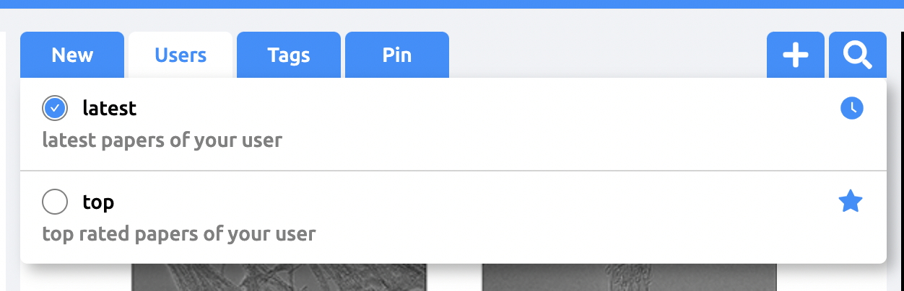

 <br />

탭 영역과 드롭 다운 영역 외를 클릭하면 드롭다운 메뉴가 사라지는 것을 구현하고자 합니다.

먼저 첫번째로 위의 탭 영역에 `useRef` 를 사용해 참조를 걸어줍니다.

```jsx
const tabRef = useRef<HTMLDivElement>(null);

<Tab ref={tabRef}> (생략) </Tab>
```

두번째로 `useEffect` 안에서  `document` 에  `click` 이벤트 리스너를 생성합니다.

`useRef` 로 생성된 객체의 `current` 에는 `contains` 라는 메서드가 있는데 

이 메서드에 현재 클릭한 엘리먼트를 인자로 넘기게 되면 참조중인 엘리먼트에 속해 있을 경우는 `true` 를 반환하고, 아닌 경우는 `false` 를 반환합니다.

```jsx
useEffect(() => {
    function handleClickOutside(e) {
      const isInside = tabRef?.current?.contains(e.target);
      console.log(isInside); //
    }

    document.addEventListener('click', handleClickOutside);
    return () => {
      document.removeEventListener('click', handleClickOutside);
    };
  }, [tabRef]);
```

이러한 특징을 사용해 탭 영역 외부를 클릭했을때 드롭다운 메뉴를 닫아 주는 기능을 실행할 수 있습니다.

```jsx
useEffect(() => {
    function handleClickOutside(e) {
      const isInsideToTab = tabRef?.current?.contains(e.target);
      if (tabRef && !isInsideToTab) {
        handleOpenTagDrop(false);
      }
    }

    document.addEventListener('click', handleClickOutside);
    return () => {
      document.removeEventListener('click', handleClickOutside);
    };
  }, [tabRef]);
```

## 느낀점

`useRef` 를 사용하기 전에는 `document` 를 클릭하면 드롭다운 메뉴가 닫기도록 구현해서 어디든 클릭을 하면 드롭다운 메뉴가 닫겨버리는 문제가 발생했습니다. 그래서 어떻게 해야할지 정말 막막했는데 `useRef` 를 사용하여 해결하는 블로그 글 덕분에 문제를 해결할 수 있었습니다.

앞으로 이런 구현이 필요한 경우에는 `useRef` 를 애용할 것 같습니다 😆

## 참고글

[https://close-up.tistory.com/entry/React-컴포넌트-특정-영역-외-클릭-감지](https://close-up.tistory.com/entry/React-%EC%BB%B4%ED%8F%AC%EB%84%8C%ED%8A%B8-%ED%8A%B9%EC%A0%95-%EC%98%81%EC%97%AD-%EC%99%B8-%ED%81%B4%EB%A6%AD-%EA%B0%90%EC%A7%80)